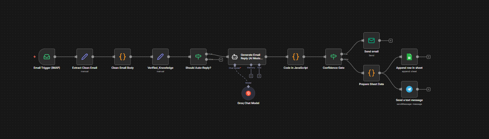
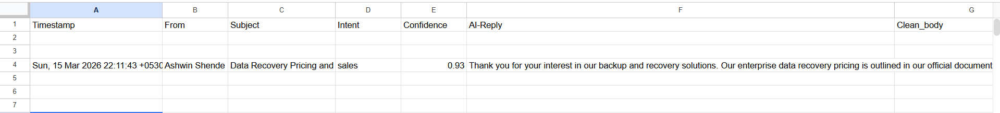

AI-Powered Email Automation & Triage System

**Overview**

This project implements an AI-driven email automation workflow that classifies incoming emails, generates responses, and routes messages based on confidence levels.

The system ensures safe automation by combining LLM-based decision making with human-in-the-loop review mechanisms.

**Key Features**

* AI-powered email intent classification
* Automated response generation
* Confidence-based decision routing
* Anti-hallucination knowledge injection
* Telegram alerts for manual review
* Audit logging using Google Sheets
* Safe automation with human oversight

**Architecture**

**Workflow**

* Incoming emails are detected via IMAP trigger
* Email content is cleaned and normalized
* Verified knowledge is injected into the AI prompt
* Groq LLM classifies intent and generates a response
* Confidence score determines routing:
* High confidence → automatic email reply
* Low confidence → manual review alert
* Low-confidence emails trigger:
* Telegram notification
* Google Sheets logging

**Tech Stack**

* n8n – Workflow automation
* Groq LLM – Intent classification & reply generation
* Telegram Bot API – Manual review alerts
* Google Sheets API – Audit logging
* JavaScript (n8n Code Nodes) – Data processing

**Screenshots**

* Workflow
* Telegram Alert
* Audit Log

**Skills Demonstrated**

* Workflow automation
* AI integration in production pipelines
* Decision systems with confidence gating
* Human-in-the-loop AI safety
* Data monitoring and logging

## Workflow Architecture

---

## Example Email Received

---

## Telegram / Alert Logging

